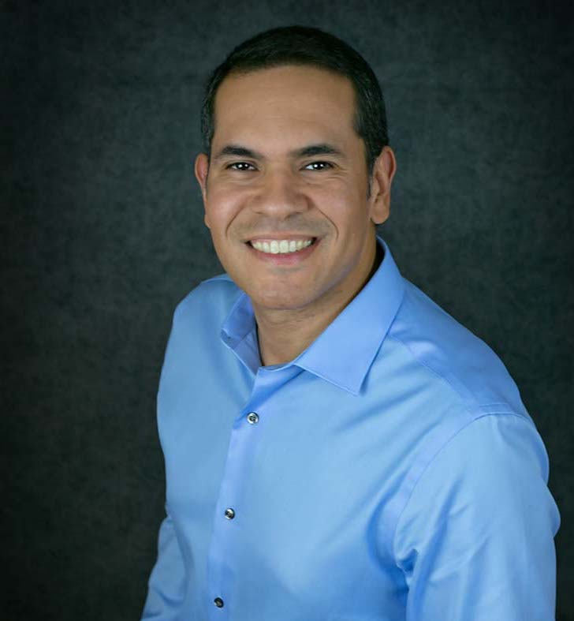
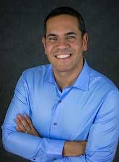

---
# Feel free to add content and custom Front Matter to this file.
# To modify the layout, see https://jekyllrb.com/docs/themes/#overriding-theme-defaults

layout: home
---

<table>
<tr> <td valign="top" style="width:25%;">  </td>
<td width="2%"> </td>
<td>
<b>Contact:</b> 
Lawrence Livermore National Laboratory, Box 808, L-561 
Livermore, CA 94551-0808 
Phone: +1-925-422-7308, Email: <a href="mailto:ilaguna@llnl.gov">ilaguna@llnl.gov</a>
</td> </tr>
</table> 

<!--

**Contact:**\\
Lawrence Livermore National Laboratory, Box 808, L-561 \\
Livermore, CA 94551-0808 \\
Phone: +1-925-422-7308, Email: [ilaguna@llnl.gov](mailto:ilaguna@llnl.gov)
 -->

----

## News

<!--
Interested in an internship? [See here](/internships/)
 -->
12-11-2018: I have been named [Better Scientific Software (BSSw) Fellow 2019](https://bssw.io/blog_posts/introducing-the-2019-bssw-fellows)\\
12-11-2018: Paper accepted at [IPDPS'19](http://www.ipdps.org/)\\
09-18-2018: Our SC'18 resilience paper is highlighted in the news at [HPCWire](https://www.hpcwire.com/2018/09/18/whats-new-in-hpc-research-september-part-1/)\\
09-17-2018: Invited talk at [School of Computing Colloquium](http://www.cs.utah.edu/calendar/colloquium-ignacio-laguna/), Univerisy of Utah\\
08-14-2018: Paper accepted at [SC'18](https://sc18.supercomputing.org/)\\
09-09-2017: We are named [R&D 100 Award Finalists!](https://www.rd100conference.com/awards/winners-finalists/year/2017/)\\
06-15-2017: Paper accepted at [SC'17](https://sc17.supercomputing.org/)

----

## Research Interests

I am a Computer Scientist at the [Center for Applied Scientific Computing](https://computation.llnl.gov/casc) (CASC) at the [Lawrence Livermore National Laboratory](https://www.llnl.gov/) (LLNL), California. My main area of research is **high-performance computing (HPC)**. My main sub-area of research in HPC is **programing models and systems**.

Specific research interests:
- Fault tolerance, resilience, error data analysis
- Software reliability, debugging, correctness
- Compiler instrumentation (LLVM), static analysis
- Scalable machine learning, statistical analysis

----

## Select Publications
- **[SC'18]** Luanzheng Guo, Dong Li, Ignacio Laguna, Martin Schulz. *FlipTracker: Understanding Natural Error Resilience in HPC Applications.* ACM/IEEE Conference for High Performance Computing, Networking, Storage and Analysis (SC), 2018.

- **[SC'17]** Giorgis Georgakoudis, Ignacio Laguna, Dimitrios S. Nikolopoulos, Martin Schulz. *REFINE: Realistic Fault Injection via Compiler-Based Instrumentation for Accuracy, Portability and Speed.* ACM/IEEE Conference for High Performance Computing, Networking, Storage and Analysis (SC), 2017.

- **[PLDI'14]** Subrata Mitra, Ignacio Laguna, Dong H. Ahn, Saurabh Bagchi, Martin Schulz, and Todd Gamblin. *Accurate Application Progress Analysis for Large-Scale Parallel Debugging.* ACM International Symposium on Programming Language Design and Implementation (PLDI), 2014.

- **[DSN'12]** Greg Bronevetsky, Ignacio Laguna, Saurabh Bagchi and Bronis R. de Supinski. *Automatic Fault Characterization via Abnormality-Enhanced Classification.* In IEEE/IFIP International Conference on Dependable Systems and Networks (DSN), 2012.

- **[DSN'10]** Greg Bronevetsky, Ignacio Laguna, Surabh Bagchi, Bronis R. de Supinski, Dong H. Ahn, Martin Schulz. *AutomaDeD: Automata-Based Debugging for Dissimilar Parallel Tasks.* IEEE/IFIP International Conference on Dependable Systems and Networks (DSN), 2010.

([All Publications](/papers/))

----

## Professional Activities

<!---
Technical Program Committee: [IPDPS'18](http://www.ipdps.org/)\\
Technical Program Committee: [CCGrid'17](https://www.arcos.inf.uc3m.es/ccgrid2017/)\\
Technical Program Committee: [SRDS'17](http://srds2017.comp.polyu.edu.hk/)\\
Technical Program Committee: [SRDS'16](http://srds2016.inf.mit.bme.hu/)\\
Technical Program Committee: [SC'16](http://sc16.supercomputing.org/)\\
Technical Program Committee: [CCGrid'16](http://ccgrid2016.uniandes.edu.co/)\\
Technical Program Committee: [ISSRE'14](http://2014.issre.net/)\\
Co-Organizer: [Correctness'18](https://correctness-workshop.github.io/2018/)\\
Co-Organizer: [Correctness'17](https://correctness-workshop.github.io/2017/)\\
Posters Committee: [SC'14](http://sc14.supercomputing.org/)\\
Technical Program Committee: [Resilience'18](https://www.csm.ornl.gov/srt/conferences/Resilience/2018/) \\
Technical Program Committee: [Resilience'17](https://www.csm.ornl.gov/srt/conferences/Resilience/2017/) \\
Technical Program Committee: [Resilience'16](https://www.csm.ornl.gov/srt/conferences/Resilience/2016/) \\
Technical Program Committee: [Resilience'15](https://www.csm.ornl.gov/srt/conferences/Resilience/2015/) \\
Technical Program Committee: [SELSE'18](https://www.selse.org/)\\
Technical Program Committee: [SELSE'17](https://www.selse.org/)\\
Technical Program Committee: [SELSE'16](https://www.selse.org/)\\
Technical Program Committee: [PROPER'13](http://www.vi-hps.org/)\\
Technical Program Committee: [PROPER'14](http://www.vi-hps.org/)\\
Technical Program Committee: [Scala'18](https://www.csm.ornl.gov/srt/conferences/Scala/2017/)\\
Technical Program Committee: [Scala'17](https://www.csm.ornl.gov/srt/conferences/Scala/2018/)\\
Technical Program Committee: [Scala'16](https://www.csm.ornl.gov/srt/conferences/Scala/2016/)
 -->

<!---
**Conference Program Committees:**
[IPDPS'19](http://www.ipdps.org/),
[IPDPS'18](http://www.ipdps.org/ipdps2018/index.html),
[CCGrid'17](https://www.arcos.inf.uc3m.es/ccgrid2017/),
[SRDS'17](http://srds2017.comp.polyu.edu.hk/),
[SRDS'16](http://srds2016.inf.mit.bme.hu/),
[SC'16](http://sc16.supercomputing.org/),
[CCGrid'16](http://ccgrid2016.uniandes.edu.co/),
[ISSRE'14](http://2014.issre.net/)\\
**Workshop Program Committees:**
[Resilience'18](https://www.csm.ornl.gov/srt/conferences/Resilience/2018/),
[Resilience'17](https://www.csm.ornl.gov/srt/conferences/Resilience/2017/),
[Resilience'16](https://www.csm.ornl.gov/srt/conferences/Resilience/2016/),
[Resilience'15](https://www.csm.ornl.gov/srt/conferences/Resilience/2015/),
[Scala'18](https://www.csm.ornl.gov/srt/conferences/Scala/2018/),
[Scala'17](https://www.csm.ornl.gov/srt/conferences/Scala/2017/),
[Scala'16](https://www.csm.ornl.gov/srt/conferences/Scala/2016/),
[SELSE'18](https://www.selse.org/),
[SELSE'17](https://www.selse.org/),
[SELSE'16](https://www.selse.org/),
[PROPER'13](http://www.vi-hps.org/),
[PROPER'14](http://www.vi-hps.org/)\\
**Workshop Co-Organizer:**
[Correctness'18](https://correctness-workshop.github.io/2018/),
[Correctness'17](https://correctness-workshop.github.io/2017/)
 -->

2019 - Program Committees: [IPDPS'19](http://www.ipdps.org/)\\
2018 - Program Committees: [IPDPS'18](http://www.ipdps.org/ipdps2018/index.html),
[Resilience'18](https://www.csm.ornl.gov/srt/conferences/Resilience/2018/),
[SELSE'18](https://www.selse.org/),
[Scala'18](https://www.csm.ornl.gov/srt/conferences/Scala/2018/),\\
2017 - Program Committees: [CCGrid'17](https://www.arcos.inf.uc3m.es/ccgrid2017/),
[SRDS'17](http://srds2017.comp.polyu.edu.hk/),
[Resilience'17](https://www.csm.ornl.gov/srt/conferences/Resilience/2017/),
[Scala'17](https://www.csm.ornl.gov/srt/conferences/Scala/2017/),
[SELSE'17](https://www.selse.org/)\\
2016 - Program Committees: [SC'16](http://sc16.supercomputing.org/),
[SRDS'16](http://srds2016.inf.mit.bme.hu/),
[CCGrid'16](http://ccgrid2016.uniandes.edu.co/),
[Resilience'16](https://www.csm.ornl.gov/srt/conferences/Resilience/2016/),
[Scala'16](https://www.csm.ornl.gov/srt/conferences/Scala/2016/),
[SELSE'16](https://www.selse.org/)\\
2015 - Program Committees: [Resilience'15](https://www.csm.ornl.gov/srt/conferences/Resilience/2015/)\\
2014 - Program Committees: [ISSRE'14](http://2014.issre.net/),
[PROPER'14](http://www.vi-hps.org/)\\
2018 - Workshop Co-Organizer: [Correctness'18](https://correctness-workshop.github.io/2018/)\\
2018 - Workshop Co-Organizer: [Correctness'17](https://correctness-workshop.github.io/2017/)

<!---
<iframe src="https://player.vimeo.com/video/137135569" width="640" height="360" frameborder="0" allowfullscreen></iframe>
 -->

